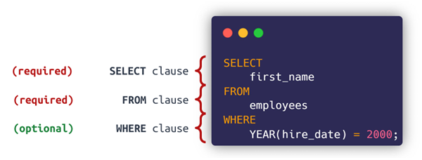
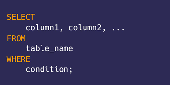

# CẨM NANG TRỞ THÀNH DATA ANALYTICS

[toc]

## Giới thiệu SQL
### SQL là gì?
SQL là từ viết tắt của Structured Query Language và được sử dụng rộng rãi để truy vấn và xử lý dữ liệu trong một database. 

Các tác vụ mà SQL hỗ trợ:
-	Thêm dòng, cập nhật giá trị hoặc xóa các bản ghi trong một database
-	Tạo bảng mới, database mới
-	Truy vấn dữ liệu từ database

Việc sử dụng thành tạo SQL là một trong những yêu cầu bắt buộc của nhân sự ngành data. Sử dụng SQL, các nhà phân tích dữ liệu có thể truy cập, xử lý, phân tích và đưa ra các insight từ các dữ liệu đươc cung cấp.

### Cấu trúc ngôn ngữ SQL
SQL là ngôn ngữ có tính chất khai báo – tức bạn cần chỉ ra **WHAT YOU WANT**, thay vì **HOW YOU WANT** (giống như casdc ngôn ngữ mệnh lệnh như Java, C++). Do đó nó rất gần với ngôn ngữ tự nhiên.

Cú pháp của SQL sẽ bắt đầu bằng một **Động từ** thể hiện hành động muốn thực hiện (chăng hạn: **SELECT**, **INSERT**, **UPDATE** hoặc **DELETE**)

Theo sau **Động từ** sẽ là **Chủ ngữ** (tên bảng muốn xử lý) và **Vị ngữ** (chẳng hạn: các cột cần lấy,  các giá trị cần chèn hoặc cập nhật…)

Trong SQL, để câu lệnh có thể thực thi thành công. Cần đảm bảo có **2 mệnh đề bắt buộc** là SELECT và FROM.
Các mệnh đề khác đều là các mệnh đề tùy chọn




### SELECT
Câu lệnh **SELECT**  sẽ chọn ra các cột từ 1 hoặc nhiều bảng, ví dụ:

```sql
select customer_name, address from customer
```
Trong câu lệnh trên, hàm **SELECT** được sử dụng để lấy ra 2 cột `customer_name` và cột `address` từ bảng `customer`.

Trường hợp muốn lấy tất cả các cột trong bảng, ta có thể dùng ký hiệu `*`, ví dụ:

```sql
select * from customer
```

### WHERE
Để lọc ra ***các dòng thỏa mãn các điều kiện cụ thể*** từ một bảng, chúng ta sử dụng **WHERE** trong câu lệnh **SELECT**.

Cú pháp của câu lệnh với WHERE như sau:



